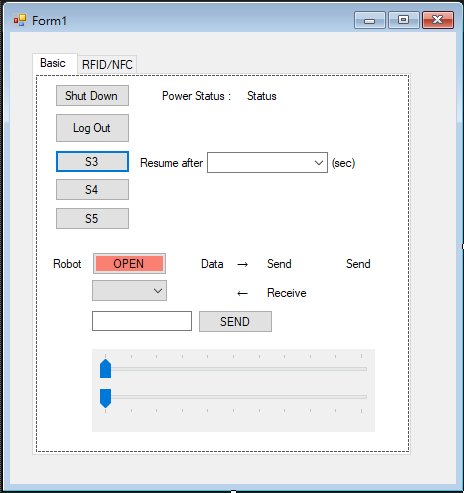
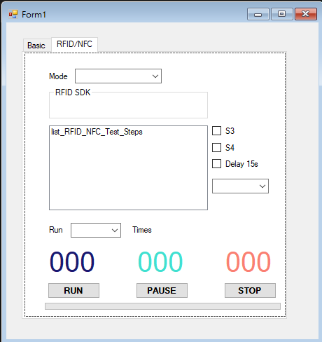

# Robotic-Test

Application to control arduino testing on RFID/NFC module on laptop with varies of power status

### Application

|  |  |
| :------------------------------ | :------------------------------------ |
|            <ul><li><code>Power otions</code></li><li><code>Serial port</code></li></ul>             |                <ul><li><code>Auto switch RFID/NFC mode</code></li><li><code>Run cycle test</code></li></ul>

### Architecture

### Flow

   

